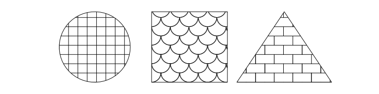

# fillpattern

<!-- badges: start -->

[](https://github.com/cmmr/fillpattern/actions/workflows/R-CMD-check.yaml)
[](https://CRAN.R-project.org/package=fillpattern)
[](https://anaconda.org/conda-forge/r-fillpattern)
<!-- badges: end -->

## Overview

`fillpattern` streamlines the process of adding distinctive yet
unobtrusive geometric patterns in place of solid grob/geom fills. The
resultant figures look just as professional when viewed by colorblind
readers or when printed in black and white.

Compared to the similar
[`ggpattern`](https://coolbutuseless.github.io/package/ggpattern/index.html)
package, `fillpattern`:

- Has no dependencies beyond base R and `ggplot2`.
- Works with `ggplot2::geom_*` functions.
- Focuses on simple geometric patterns.

## Installation

``` r
# Install the latest stable version from CRAN:
install.packages("fillpattern")

# Or the development version from GitHub:
install.packages("remotes")
remotes::install_github("cmmr/fillpattern")
```

## Usage

Simply add `scale_fill_pattern()` to your ggplot.

``` r
library(ggplot2)
library(fillpattern)

ggplot(mpg, aes(x = class, color = drv, fill = drv)) +
  geom_bar() +
  scale_fill_pattern()
```

<!-- -->

Works with `geom_bar()`, `geom_boxplot()`, `geom_violin()`, and other
`geom_*` functions that accept a `fill` aesthetic.

### grid grobs

Set `fill = fill_pattern()` in the grob’s graphical parameters.

``` r
library(grid)
library(fillpattern)

grid.newpage()
grid.circle( gp = gpar(fill = fill_pattern("grid")), x = 1/4, r = 3/8)
grid.rect(   gp = gpar(fill = fill_pattern("fish")), width = 1/5, height = 3/4)
grid.polygon(gp = gpar(fill = fill_pattern("brick")), x = c(6,7,5)/8, y = c(7,1,1)/8)
```

<!-- -->

## Basic Patterns

Use any of these pattern names in `fill_pattern()` or
`scale_fill_pattern()`.

<!-- -->

## Modified Patterns

For each basic pattern, you can specify the foreground color, background
color, line width/style, tile size/rotation, and more through arguments
to `fill_pattern()` and `scale_fill_pattern()`.

Most modifications can be also be specified as part of the pattern name
(shown below).

<!-- -->

For additional details, see the `fill_pattern()` and
`scale_fill_pattern()` reference pages.
