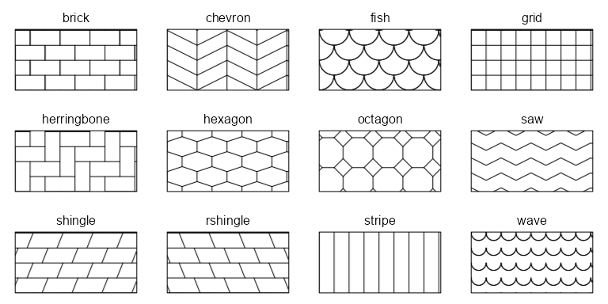

<!-- Run `devtools::build_readme()` after editing.  -->

# fillpattern 

<!-- badges: start -->

[](https://CRAN.R-project.org/package=fillpattern)
[](https://anaconda.org/conda-forge/r-fillpattern)
[](https://cranlogs.r-pkg.org/)
[](https://app.codecov.io/gh/cmmr/fillpattern)
<!-- badges: end -->

`fillpattern` provides geometric patterns to replace solid color fills
in statistical graphics. These patterns ensure figures remain
distinguishable when viewed by colorblind readers or when printed in
black and white.

Compared to the similar
[`ggpattern`](https://coolbutuseless.github.io/package/ggpattern/index.html)
package, `fillpattern`:

- Has no dependencies beyond base R and
  [`ggplot2`](https://ggplot2.tidyverse.org).
- Works with `ggplot2::geom_*` functions.
- Focuses on simple geometric patterns.

## Installation

``` r
# Install the latest stable version from CRAN:
install.packages("fillpattern")

# Or the development version from GitHub:
install.packages("pak")
pak::pak("cmmr/fillpattern")
```

## Usage

Simply add
[`scale_fill_pattern()`](https://cmmr.github.io/fillpattern/reference/scale_fill_pattern.html)
to your ggplot.

``` r
library(ggplot2)
library(fillpattern)

ggplot(mpg, aes(x = class, color = drv, fill = drv)) +
  geom_bar() +
  scale_fill_pattern()
```

<!-- -->

Works with `geom_bar()`, `geom_boxplot()`, `geom_violin()`, and other
`geom_*` functions that accept a `fill` aesthetic.

### grid grobs

Set `fill = fill_pattern()` in the grob’s graphical parameters.

``` r
library(grid)
library(fillpattern)

grid.newpage()
grid.circle( gp = gpar(fill = fill_pattern("grid")), x = 1/4, r = 3/8)
grid.rect(   gp = gpar(fill = fill_pattern("fish")), width = 1/5, height = 3/4)
grid.polygon(gp = gpar(fill = fill_pattern("brick")), x = c(6,7,5)/8, y = c(7,1,1)/8)
```

<!-- -->

## Basic Patterns

Use any of these pattern names in
[`fill_pattern()`](https://cmmr.github.io/fillpattern/reference/fill_pattern.html)
or
[`scale_fill_pattern()`](https://cmmr.github.io/fillpattern/reference/scale_fill_pattern.html).

<!-- -->

## Modified Patterns

For each basic pattern, you can specify the foreground color, background
color, line width/style, tile size/rotation, and more through arguments
to
[`fill_pattern()`](https://cmmr.github.io/fillpattern/reference/fill_pattern.html)
and
[`scale_fill_pattern()`](https://cmmr.github.io/fillpattern/reference/scale_fill_pattern.html).

Most modifications can be specified as part of the pattern name (shown
below).

<!-- -->

For additional details, see the
[`fill_pattern()`](https://cmmr.github.io/fillpattern/reference/fill_pattern.html)
and
[`scale_fill_pattern()`](https://cmmr.github.io/fillpattern/reference/scale_fill_pattern.html)
reference pages.
